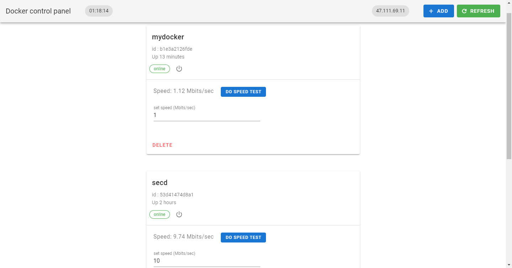
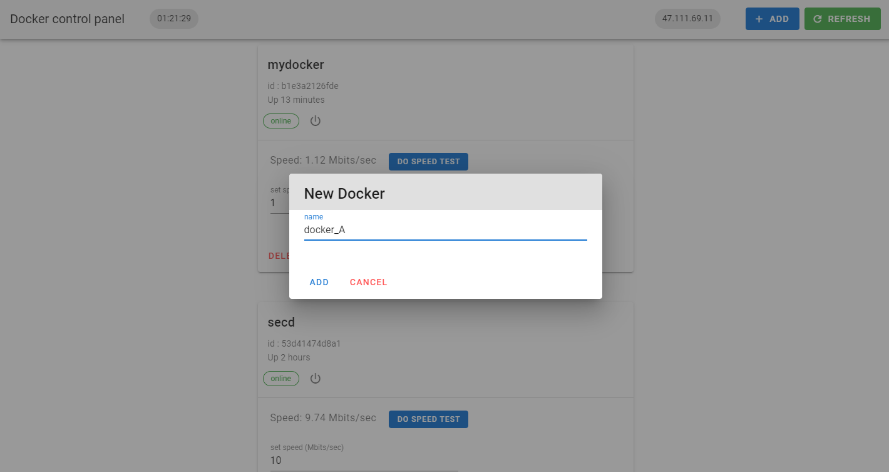
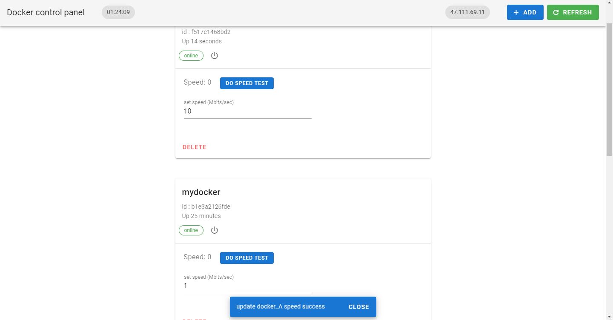

# Docker-oriented-traffic-shaping

1.**Overview**

2.**Environment**

3.**File Directory**

4.**Server parameter configuration**

5.**Run this system**

6.**Attention**
 <br> <br>

**Overview**

Docker is a popular container technology in recent years. Unlike virtual machine
technology that virtualizes hardware, docker runs under a single Linux through
Linux resource allocation mechanisms such as cgroup, which makes the resource
usage much lower than virtual machines.

Since the allocation of docker's underlying resources (CPU, memory, net, etc.)
is based on cgroup, the dynamic traffic shaping of docker can be achieved
through tc's traffic shaping of cgroup.

**Environment**

|name|version|
|--------|-------|
| Python | 3.7.7 |
| Fabric | 2.5.0 |
| Flask  | 1.1.2 |

**File Directory**
```
│  docker_conn.py
│  flask_docker.py
│
├─config
│      apt_source
│      docker_config
│      server_config
│
└─static
    │  favicon.ico
    │  index.html
    │
    ├─CSS
    │      chunk-vendors.8dd5ae3.css
    │
    └─JS
            app.71b3fef1.js
            app.71b3fef1.js.map
            chunk-vendors.9006551a.js
            chunk-vendors.9006551a.js.map
```

docker_conn.py: Encapsulated docker control function

flask_docker.py: The Back end that controls the docker network

/static: Front-end static files

**Server parameter configuration**

Edit the flask/config/server_config

First line: server IP address

Second line: server root username

Third line: server ssh port

Fourth line: server ssh password
 <br> <br>
Example:
```

\----server.config----

128.128.128.128

root

22

12345678

\----------end----------
```

**Run this system**

to run this project, run flask/flask_docker.py

**Attention**

1.Since docker's cgroup is mounted in the Linux system folder, ssh requires
    **root** privileges to enter.

2.The default bandwidth of each docker is 1Mbit/s, and the
    bandwidth will be automatically tested every time a new bandwidth limit is
    submitted.

**System screenshot**

1.Homepage


2.Add docker


2.Update speed


For the source code of web front end, check <a href="https://github.com/RFYoung/Docker-oriented-traffic-shaping-frontend">Docker-oriented-traffic-shaping-frontend </a>

