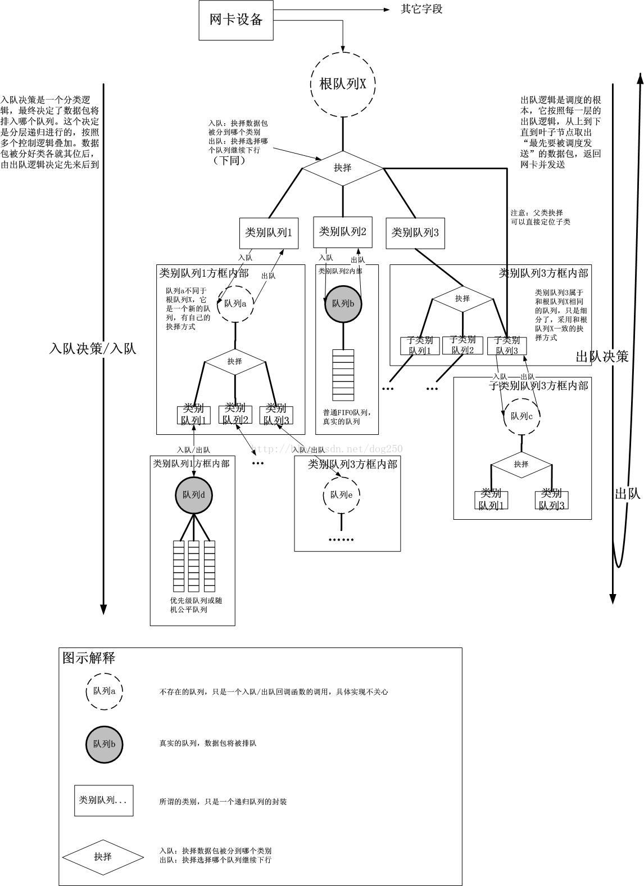
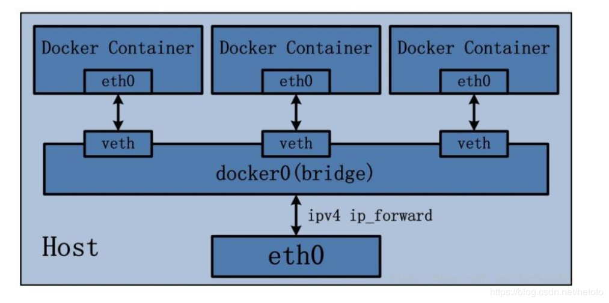
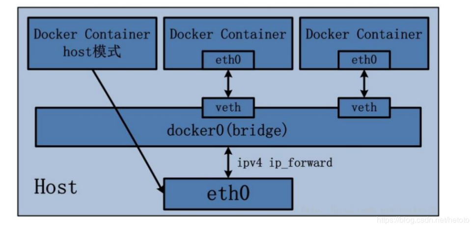
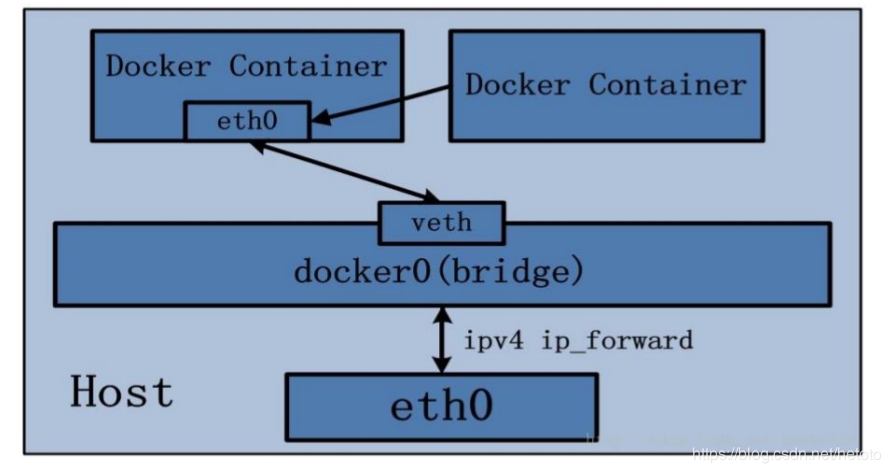
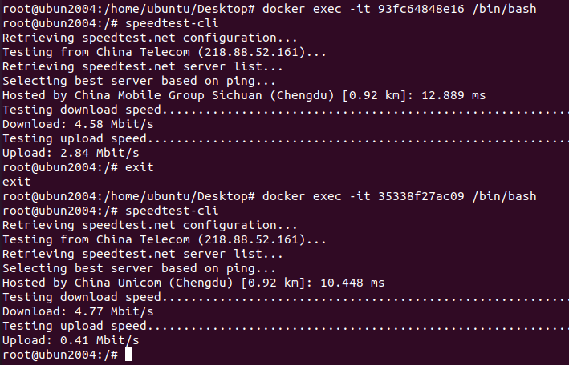

## title: 'Traffic shaping by tc and cgroup(Docker) -- Part 1'

-   **TC (traiic shaping) is a very effective tool for shaping traffic.**

*Four main ways to control traffic:*

-   **shaping**

Shaping is often aimed at outbound traffic, because the system can queue and
layer traffic in the cache queue area before outbound, and for inbound traffic,
because the sender buffer cannot be controlled, packet loss can only be handled
through traffic policing. (There is a way to handle inbound traffic shaping
using IFB)

-   **scheduling**

Prioritize outbound packets

-   **policing**

Processing inbound traffic

-   **dropping**

Discard inbound and outbound packets

*tc flow control is handled by three objects:*

-   qdisc(queueing discipline)

qdisc is divided into two categories

[claseless qdisc]{.ul}

claseledd qdisc is a kind of qdisc without class.Although for some qdisc, it has
a certain classification of packets (for example: pfifo_fast), but its
classification function is very fixed, and it cannot configure an advanced
hierarchy.

*Some commonly used claseless qdisc:*

1.  pfifo

2.  pfifo_fast

3.  red(Random Early Detection)

4.  sqf(Stochastic Fairness Queueing)

5.  tbf(Token Bucket Filter)

In claseless qdisc, tbf is mainly used for traffic speed limit. In tbf, it has a
token mechanism. Initially, the token fills the entire bucket to deal with the
outbreak of traffic, and when the traffic is queued The cards are issued in the
bucket at a certain rate and combined with the traffic packets that enter the
team. Only the traffic packets that have tokens can be dequeued.

[classful qdisc]{.ul}

1.  cbq(Class Based Queueing)

2.  htb(Hierarchy Token Bucket)

3.  prio

Among these classful qdisc, htb is often the most commonly used. Piro is often
used in conjunction with htb. htb is a queue rule based on tbf, which implements
complex traffic shaping by layering.

-   class

Class is a label used by classful qdisc to layer traffic. A classful qdisc often
requires a handle, and class is the ID (handel:classid) of the slave behind this
handle. For classes that belong to the same qdisc, the major ID is the
same.Through such subordinate structure, a complex classification often forms a
tree structure

-   filter

filter is a class-based traffic filter, also only exists in classful qdisc,
which can filter and shunt traffic by setting filtering requirements and target
handles

tc concept map:

-   **Docker is a efficient operating system layer virtualization application**

*For Docker, it has four network modes:*

-   bridge network mode

In bridge mode, docker has no public IP, and all network communication is based
on veth pair technology to create two virtual network interface devices on the
host.The virtual network card in docker is responsible for outbound traffic, and
veth is responsible for inbound traffic.

-   host network mode

In host mode, the host's IP will be shared by the host and Docker. The host's
network card directly takes over Docker inbound and outbound traffic.

-   none network mode

In this mode, Docker will no longer have an external network connection

-   container network mode

In this mode, Docker will share the virtual network card inside Docker with
another specified Docker

-   **cgroup is a efficient resource management tool**

Docker is a container technology, which can quickly deploy the required
applications and corresponding environments, with fast and lightweight features.
In Linux systems, Docker resource configuration is done by cgroups(Linux Control
Groups).

*cgroup can control the following resources:*

-   cpu --Restrict cpu permissions

-   memory --Limit memory usage

-   blockio --Limit I/O rate

-   cpuset --Limit the use of CPU cores

-   cpuacct --Record CPU usage time

-   device --Restrict access to devices

-   frezzer --Control process suspend and resume

-   ns --Namespace subsystem

-   **net_cls --Label network packets**

-   net_proi --Set network device priority

-   **Mark Docker outbound traffic via cgroup**

[Docker network mode: host]{.ul}

[Target network card: host network card]{.ul}

When choose to mark Docker traffic, it is best to choose the host mode. The
reason is that when using the bridge network mode, if you label the virtual
bridge docker0, all Docker will be labeled the same label. For eth0 and veth,
inbound traffic can be controlled by veth, but outbound traffic needs to enter
the corresponding Docker, which is obviously not suitable. Therefore, choose to
use Docker's host mode and set up queuing rules on the host network card.

docker run -itd --name docker-test --network=host  ubuntu /bin/bash

After docker is running in host mode, enter the cgroup corresponding to DockerID
and write the mark to net_cls.classid

echo 0x_____\_ \> net_cls.classid

Example: 0x100001 First 2:Major ID Last 2:Minor ID

-   **Shaping Docker traffic through tc**

In tc, create qdisc and establish classification and filter for different Docker
packet labels.

tc qdisc del dev ens33 root

tc qdisc add dev ens33 root handle 1: htb

tc class add dev ens33 parent 1:0 classid 1:1 htb rate 4Mbit burst 15k

tc class add dev ens33 parent 1:1 classid 1:10 htb rate 0.4Mbit ceil 0.5Mbit
burst 15k

tc class add dev ens33 parent 1:1 classid 1:20 htb rate 1Mbit ceil 3Mbit burst
15k

tc class add dev ens33 parent 1:10 classid 1:30 htb rate 0.1Mbit ceil 0.3Mbit
burst 15k

tc filter add dev ens33 parent 1:0 protocol ip prio 1 handle 1: cgroup

-   **Traffic shaping results**

Target:

**DockerA:** 1-3 Mbit Upstream broadband

**DockerB:** 0.1-0.3 Mbit Upstream broadband

results:

It can be seen from the test results that although the final result has a
certain deviation at low bandwidth, the overall is in line with expectations.
